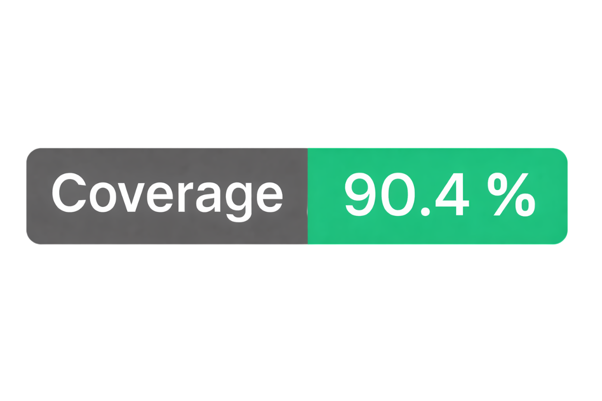
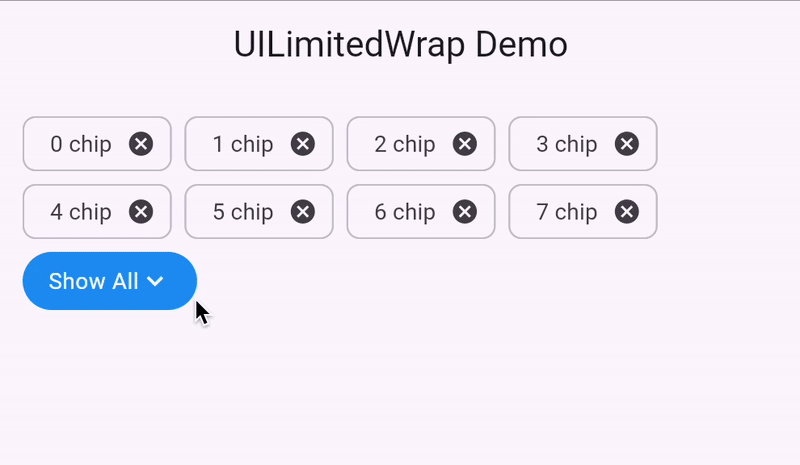

# Limited Wrap



A Flutter widget that extends the standard `Wrap` functionality with line limiting capabilities and a customizable "Show All" button. Perfect for displaying tags, chips, filters, or any content that needs to be truncated with an expand option.

## Preview


## Usage

### Basic Example

```dart
class LimitedWrapExampleWidget extends StatefulWidget {
  const LimitedWrapExampleWidget({super.key});

  @override
  State<LimitedWrapExampleWidget> createState() => _LimitedWrapExampleWidgetState();
}

class _LimitedWrapExampleWidgetState extends State<LimitedWrapExampleWidget> {
  bool _expanded = false;

  @override
  Widget build(BuildContext context) {
    return UILimitedWrap(
      spacing: 8.0,
      runSpacing: 8.0,
      maxLines: _expanded ? 4 : 2, 
      clipBehavior: Clip.hardEdge,
      showAllButton: InkWell(
        onTap: () {
          setState(() {
            _expanded = !_expanded;
          });
        },
        child: Container(
          padding: const EdgeInsets.symmetric(horizontal: 16, vertical: 8),
          decoration: BoxDecoration(
            color: Colors.blue,
            borderRadius: BorderRadius.circular(20),
          ),
          child: Row(
            mainAxisSize: MainAxisSize.min,
            children: [
              Text(
                _expanded ? 'Show Less' : 'Show All',
                style: const TextStyle(color: Colors.white),
              ),
              Icon(
                _expanded ? Icons.expand_less : Icons.expand_more,
                color: Colors.white,
                size: 20,
              ),
            ],
          ),
        ),
      ),
      children: _buildTags(),
    );
  }

  List<Widget> _buildTags() {
    final tags = List<String>.generate(100, (index) => '$index chip');

    return tags
        .map((tag) => Chip(
              label: Text(tag),
              onDeleted: () {
              },
            ))
        .toList();
  }
}
```

## Parameters

1. **children** (List of Widgets, required) — list of widgets to display in the wrap
2. **showAllButton** (Widget, required) — widget displayed when content exceeds maxLines
3. **spacing** (double, default 0.0) — horizontal spacing between children
4. **runSpacing** (double, default 0.0) — vertical spacing between rows
5. **maxLines** (int?, default null) — maximum number of visible rows; null means unlimited
6. **clipBehavior** (Clip, default Clip.none) — how to clip overflowing content